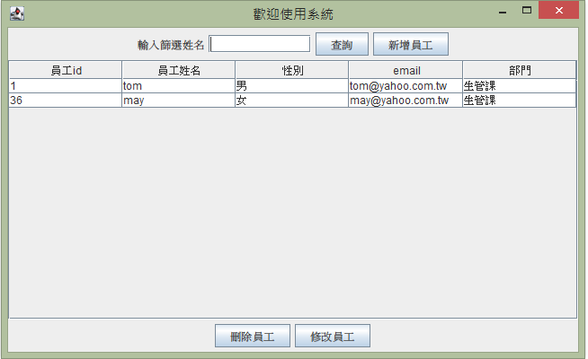
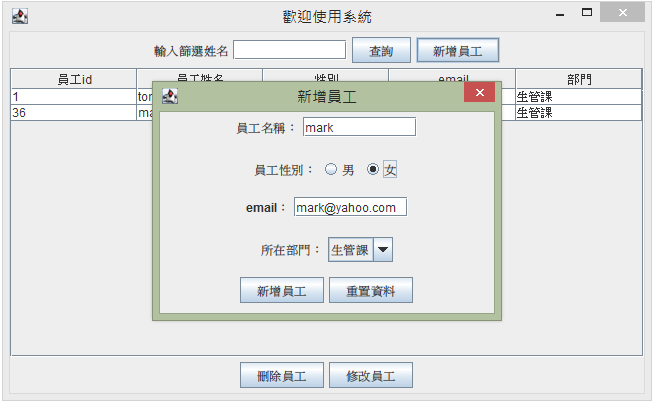
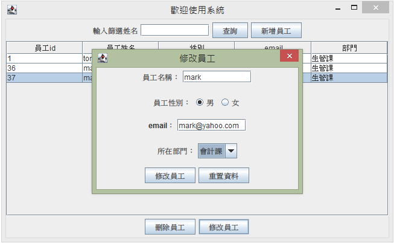
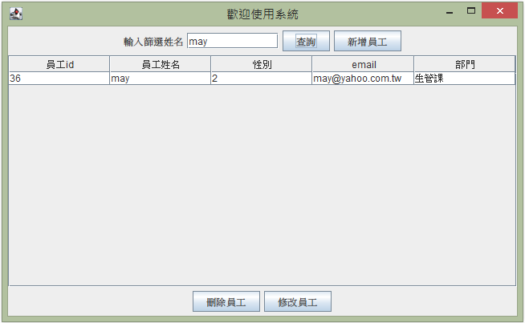

# Simple-Java-Swing-CRUD

## Preview

**List Page**
 

**Create Page** 
 

**Edit Page**
 

**Search Employee**
 

## Technologies Used

- JDBC
- Swing

## Features

- Basic create, read, update, delete and search.

## Requirements
- Eclipse 2020-12 (4.18.0)
- Java 1.8
- Mysql  5.7
